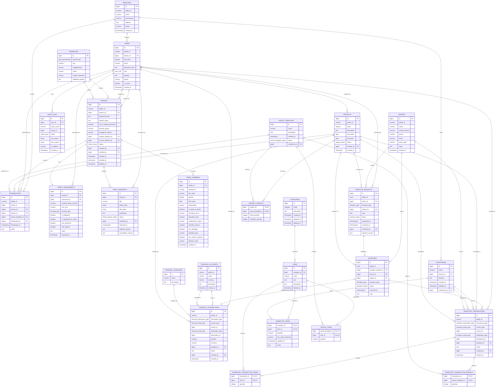

# Entity Relationship Diagram

The ERD diagram below summarizes the entities and their relationships.

```mermaid
erDiagram
    BRANCHES ||--o{ USERS : "employs"
    BRANCHES ||--o{ INVENTORIES : "hosts"
    BRANCHES ||--o{ DISTRIBUTIONS : "records"

    USERS ||--o{ FAMILIES : "created_by"
    USERS ||--o{ FAMILIES : "verified_by"
    USERS ||--o{ FAMILY_ASSESSMENTS : "assessed_by"
    USERS ||--o{ FAMILY_REQUESTS : "reviewed_by"
    USERS ||--o{ PROJECTS : "created_by"
    USERS ||--o{ DISTRIBUTIONS : "distributed_by"
    USERS ||--o{ DONATION_REQUESTS : "reviewed_by"
    USERS ||--o{ FINANCIAL_TRANSACTIONS : "created_by"
    USERS ||--o{ INVENTORY_TRANSACTIONS : "created_by"
    USERS ||--o{ AUDIT_LOGS : "emits"

    ADDRESSES ||--o{ FAMILIES : "original"
    ADDRESSES ||--o{ FAMILIES : "current"

    FAMILIES ||--o{ FAMILY_MEMBERS : "contains"
    FAMILIES ||--|| FAMILY_ASSESSMENTS : "has"
    FAMILIES ||--o{ FAMILY_REQUESTS : "submits"
    FAMILIES ||--o{ DISTRIBUTIONS : "receives"

    CATEGORIES ||--o{ ITEMS : "classifies"

    ITEMS ||--o{ INVENTORY_ITEMS : "stocked_in"
    INVENTORIES ||--o{ INVENTORY_ITEMS : "holds"

    ITEMS ||--o{ PARCEL_ITEMS : "packed_in"
    PARCEL_TEMPLATES ||--o{ PARCEL_ITEMS : "contains"

    DONORS ||--o{ DONATION_REQUESTS : "submits"
    DONORS ||--o{ DONATIONS : "makes"
    DONATION_REQUESTS ||--o| DONATIONS : "fulfilled_as"
    PROJECTS ||--o{ DONATIONS : "purpose_of"
    PROJECTS ||--o{ DONATION_REQUESTS : "purpose_of"

    DONATIONS ||--o| FINANCIAL_TRANSACTIONS : "monetary_settlement"
    DONATIONS ||--o{ INVENTORY_TRANSACTIONS : "physical_settlement"

    PROJECTS ||--o{ PROJECT_PARCELS : "allocates"
    PARCEL_TEMPLATES ||--o{ PROJECT_PARCELS : "used_by"
    PROJECTS ||--o{ DISTRIBUTIONS : "executed_as"
    PARCEL_TEMPLATES ||--o{ DISTRIBUTIONS : "delivered_as"

    PROJECTS ||--o{ INVENTORY_TRANSACTIONS : "allocated_to"
    INVENTORIES ||--o{ INVENTORY_TRANSACTIONS : "source"
    INVENTORIES ||--o{ INVENTORY_TRANSACTIONS : "destination"
    DONORS ||--o{ INVENTORY_TRANSACTIONS : "source"
    PROJECTS ||--o{ INVENTORY_TRANSACTIONS : "destination"

    INVENTORY_TRANSACTIONS ||--o{ INVENTORY_TRANSACTION_ITEMS : "contains"
    INVENTORY_TRANSACTIONS ||--o{ INVENTORY_TRANSACTION_PARCELS : "contains"
    ITEMS ||--o{ INVENTORY_TRANSACTION_ITEMS : "listed_in"
    PARCEL_TEMPLATES ||--o{ INVENTORY_TRANSACTION_PARCELS : "listed_in"

    FINANCIAL_ACCOUNTS ||--o{ FINANCIAL_TRANSACTIONS : "source"
    FINANCIAL_ACCOUNTS ||--o{ FINANCIAL_TRANSACTIONS : "destination"
    EXPENSE_CATEGORIES ||--o{ FINANCIAL_TRANSACTIONS : "charged_as"
    PROJECTS ||--o{ FINANCIAL_TRANSACTIONS : "destination"

    BRANCHES {
        bigint id PK
        varchar public_id
        varchar name
        varchar governorate
        text address
        varchar phone
        timestamp created_at
    }
    USERS {
        bigint id PK
        varchar public_id
        bigint branch_id FK
        varchar full_name
        varchar email
        text password_hash
        user_role role
        text address
        varchar phone
        boolean is_active
        timestamp created_at
    }
    AUDIT_LOGS {
        bigint id PK
        bigint user_id FK
        varchar entity_name
        bigint entity_id
        audit_action action
        jsonb old_values
        jsonb new_values
        varchar ip_address
        timestamp created_at
    }
    ADDRESSES {
        bigint id PK
        gaza_governorate governorate
        varchar city
        varchar neighborhood
        varchar street
        varchar nearby_landmark
        text additional_details
    }
    FAMILIES {
        bigint id PK
        varchar public_id
        bigint branch_id FK
        text password_hash
        text refresh_token
        boolean must_change_password
        varchar primary_phone
        varchar emergency_phone
        bigint original_address_id FK
        bigint current_address_id FK
        family_status status
        bigint created_by FK
        bigint verified_by FK
        timestamp verified_at
        timestamp created_at
        timestamp deleted_at
    }
    FAMILY_MEMBERS {
        bigint id PK
        bigint family_id FK
        varchar national_id
        varchar full_name
        gender gender
        date birth_date
        varchar relationship
        boolean is_head_of_family
        varchar education_level
        numeric education_fees
        varchar employment_status
        numeric monthly_income
        boolean has_disability
        varchar disability_type
        boolean has_chronic_disease
        varchar disease_name
        timestamp created_at
    }
    FAMILY_ASSESSMENTS {
        bigint id PK
        bigint family_id FK
        bigint assessed_by FK
        numeric monthly_family_income
        numeric rent_cost
        housing_type housing_type
        boolean is_displaced
        boolean is_registered_in_camp
        boolean has_electricity
        boolean has_internet
        text notes
        timestamp assessed_at
    }
    FAMILY_REQUESTS {
        bigint id PK
        bigint family_id FK
        varchar title
        jsonb before_data
        jsonb after_data
        text justification
        family_request_status status
        bigint reviewed_by FK
        timestamptz reviewed_at
        text rejection_reason
        text cancellation_reason
    }
    CATEGORIES {
        bigint id PK
        category name
        text description
        timestamp created_at
        timestamp updated_at
        timestamp deleted_at
    }
    ITEMS {
        bigint id PK
        bigint category_id FK
        varchar name
        unit unit
        text description
        timestamp deleted_at
    }
    INVENTORIES {
        bigint id PK
        varchar name
        bigint branch_id FK
        text location
        timestamp created_at
        timestamp updated_at
        bigint created_by_id FK
    }
    INVENTORY_ITEMS {
        bigint inventory_id PK,FK
        bigint item_id PK,FK
        numeric quantity
        numeric low_stock_threshold
        timestamp updated_at
        text notes
    }
    PARCEL_TEMPLATES {
        bigint id PK
        varchar name
        text description
        timestamp created_at
        parcel_template_status status
        bigint created_by_id FK
    }
    PARCEL_ITEMS {
        bigint parcel_template_id PK,FK
        bigint item_id PK,FK
        numeric quantity
    }
    PROJECTS {
        bigint id PK
        varchar public_id
        varchar name
        text description
        date start_date
        date end_date
        project_status status
        bigint created_by FK
        timestamp created_at
    }
    PROJECT_PARCELS {
        bigint project_id PK,FK
        bigint parcel_template_id PK,FK
        integer initial_quantity
        integer available_quantity
    }
    DISTRIBUTIONS {
        bigint id PK
        varchar public_id
        bigint family_id FK
        bigint branch_id FK
        bigint project_id FK
        bigint parcel_template_id FK
        bigint distributed_by FK
        timestamp distributed_at
        text notes
    }
    DONORS {
        bigint id PK
        varchar public_id
        varchar name
        varchar contact_person
        varchar phone
        varchar email
        varchar donor_type
        text notes
        timestamp created_at
    }
    DONATION_REQUESTS {
        bigint id PK
        uuid public_id
        bigint donor_id FK
        donation_type donation_type
        bigint project_id FK
        text note
        request_status status
        timestamptz requested_at
        timestamptz reviewed_at
        bigint reviewed_by FK
        text rejection_reason
    }
    DONATIONS {
        bigint id PK
        uuid public_id
        bigint donation_request_id FK
        bigint donor_id FK
        bigint project_id FK
        donation_type donation_type
        donation_status status
        timestamptz received_at
        text note
    }
    FINANCIAL_ACCOUNTS {
        bigint id PK
        varchar public_id
        varchar name
        varchar currency
        text description
        timestamp created_at
    }
    EXPENSE_CATEGORIES {
        bigint id PK
        varchar name
        text description
    }
    FINANCIAL_TRANSACTIONS {
        bigint id PK
        varchar public_id
        financial_transaction_type transaction_type
        financial_entity_type source_type
        bigint source_id
        financial_entity_type destination_type
        bigint destination_id
        numeric amount
        varchar currency
        bigint donation_id FK
        text notes
        bigint created_by FK
        timestamp created_at
    }
    INVENTORY_TRANSACTIONS {
        bigint id PK
        varchar public_id
        inventory_transaction_type transaction_type
        inventory_entity_type source_type
        bigint source_id
        inventory_entity_type destination_type
        bigint destination_id
        bigint donation_id FK
        text notes
        bigint created_by FK
        timestamp created_at
    }
    INVENTORY_TRANSACTION_ITEMS {
        bigint transaction_id PK,FK
        bigint item_id PK,FK
        integer quantity
    }
    INVENTORY_TRANSACTION_PARCELS {
        bigint transaction_id PK,FK
        bigint parcel_template_id PK,FK
        integer quantity
    }
```
